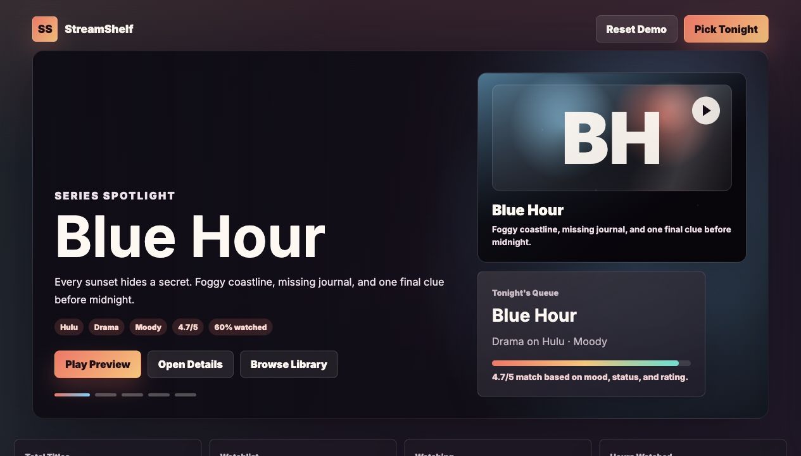
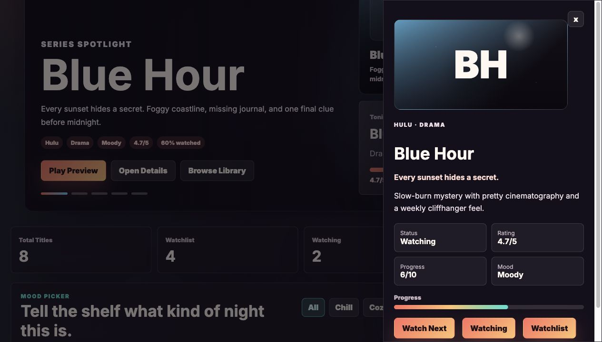

# StreamShelf

StreamShelf is a personal media tracker built for my software engineering portfolio. It has the feel of a streaming app, but the goal is more practical: help someone keep up with what they want to watch, what they are already watching, what they finished, and what fits their mood that night.



## Live Demo

[View StreamShelf on GitHub Pages](https://briannab1997.github.io/BB-StreamShelf/)

## Why I Built It

I wanted one of my portfolio projects to feel more creative and entertainment-focused while still showing real front-end application logic. StreamShelf is built around a small mock media library, but it behaves like a useful product: users can rotate through featured titles, preview a show-style hero, filter by mood, get a "Pick Tonight" recommendation, open a detail drawer, update progress, and save changes in the browser.

## Screenshots




## Features

- Browse an interactive mock streaming library
- Rotate through a featured-title slideshow
- View custom show-style poster art and preview panels
- Use mood chips to narrow the experience
- Filter by genre, platform, and status
- Search by title, platform, genre, or mood
- View a Continue Watching rail
- Track Watchlist, Watching, Finished, and Favorite statuses
- Increment episode progress
- View ratings, runtime, mood, and notes
- Get a "Pick Tonight" recommendation
- Trigger a faux preview animation without relying on copyrighted video
- Open a detail drawer for each title
- Save demo changes in local storage
- Reset the demo back to the original sample data

## Tech Stack

- HTML
- CSS
- JavaScript
- Local storage
- Mock service layer
- Node-based tests

## Run Locally

```bash
npm start
```

## Run Tests

```bash
npm test
```

## Portfolio Note

StreamShelf shows product thinking, state management, filtering, responsive UI design, local storage, and interactive detail workflows in a more creative entertainment-focused package.
